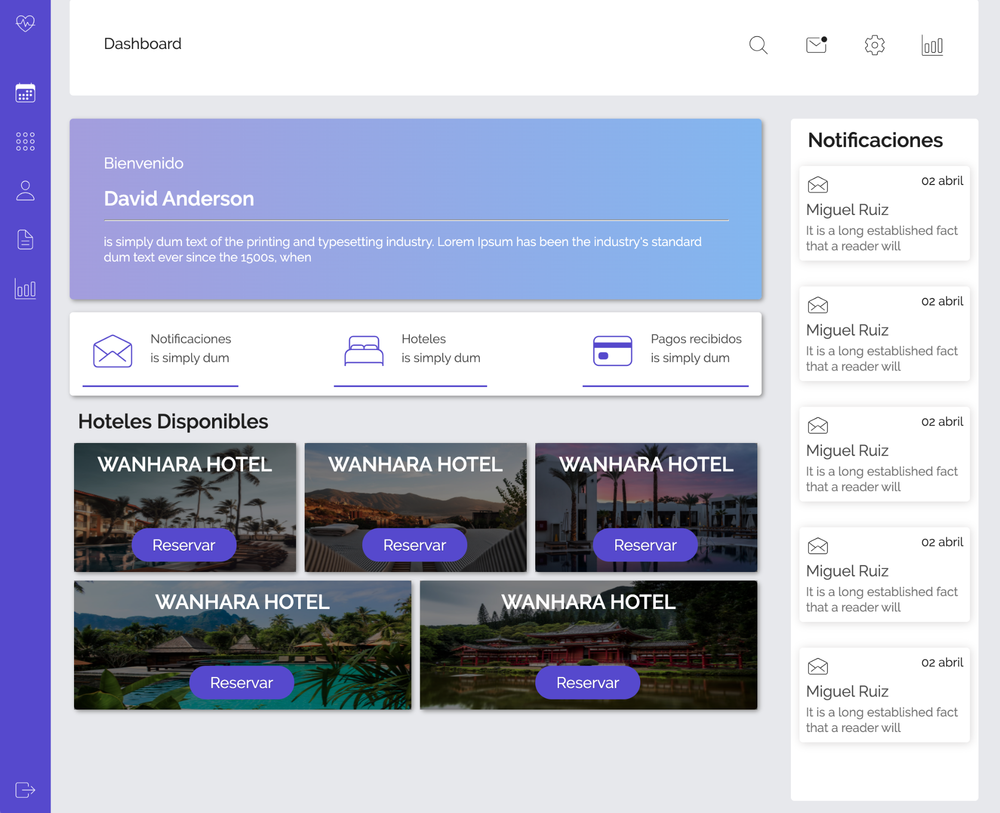

# test_rioserrano

Test técnico:  Diseñador UI/UX

Se solicita:
Realizar Maquetado Html, Css y subirla a un repositorio en GitHub.
Entendiendo que el negocio que sustenta la plataforma de la imagen, es un dashboard para clientes del rubro de la hoteleria:  
¿Qué sugerencias a la usabilidad, diseño o tareas puedes indicar para mejorar el UX?
Considerando el punto anterior: 
¿Qué tareas y/o herramientas definirias para que el producto a desarrollar tenga una mejora continua en términos de usabilidad?

Adquieres mayor puntuación si:
Utilizas Pre-procesador CSS, ojalá Saas.
El Css es Legible
El Html es semántico
Utilizas selectores descendientes
Utilizar nombres descriptivos
El resultado es responsivo y se puede ver en grandes pantallas, tablet o celulares
Utilizar validador Css de la W3C
Uso de prefijos
Realizar animaciones que mejorarian la experiencia del usuario

============================================================================

Respuestas

¿Qué sugerencias a la usabilidad, diseño o tareas puedes indicar para mejorar el UX?

Sugerencias de usabilidad.
- Darle importancia a los focos, saber donde me encuentro en mi dashboard y con qué elementos puedo interactuar, 
teniendo animaciones, contraste, reacciones a eventos del mouse, etc.
- Permitir personalizar el orden de las herramientas de mi dashboard, por ejemplo los elementos del menú lateral. 
Moverlos dentro del menú para tener un orden que me sea a mi cómodo de trabajar, así como también poder configurar tamaños de letras 
y contrastes por si el usuario posee problemas de lectura.
Sugerencias de diseño
- Simplificar el diseño, trataremos siempre de no sobrecargar de información porque queremos que el usuario se enfoque en una cosa. 
- visualizar por ejemplo, la cantidad de notificaciones pendientes de lectura, ya que le brinda información al usuario de su trabajo pendiente,
o urgencia de estas.
- Análisis de los contrastes de colores, elementos llamativos pero no sobrecargar lo visual.
Sugerencia de tareas
- Disponer un historial, esto permite reutilizar elementos o poder recurrir a una ayuda, no necesitamos que el usuario recuerde todo, 
si no que tenga un lugar donde poder recurrir que lo ayude a esta tarea.

¿Qué tareas y/o herramientas definirías para que el producto a desarrollar tenga una mejora continua en términos de usabilidad?
Herramientas cómo Figma permiten trabajar de manera ordenada y muy escalable.

link figma : https://www.figma.com/file/mMYttI4ZrnY6VjlAR9lWag/Untitled?node-id=0%3A1

link zeplin: https://zpl.io/bPGEQXl

Con esta herramientas es posible realizar diseño, prototipado y testeo, con los cual podemos realizar, por ejemplo: 
- Testeo A/B, si llegamos a dos posibles soluciones para el punto de dolor identificado y queremos definir cuál tiene mejor recepción. 
- Mapas de calor, para saber si hay que simplificar accesos, sacar o disponer de otros, identificar si hay puntos de la pantalla que están 
logrando mas atención para poder utilizarlos de mejor manera
- Test de usabilidad con usuarios finales, ellos saben qué necesitan tener a la mano, por ende tener feedback directo de ellos en el desarrollo, 
de herramientas a las cuales le dan mas uso o alguna que crean necesario incorporar.
Ademas, Figma permite integrar plugins, por ejemplo el plugin de useberry nos permite hacer testeos de flow de navegación, 
para saber si el usuario es capaz de completar una tarea.

Todas estas tareas que se realizan con usuarios nos permite iterar sobre la solución que estamos planteando con un flujo y poder mejorar 
la experiencia y la usabilidad de nuestro sitio/aplicación.
